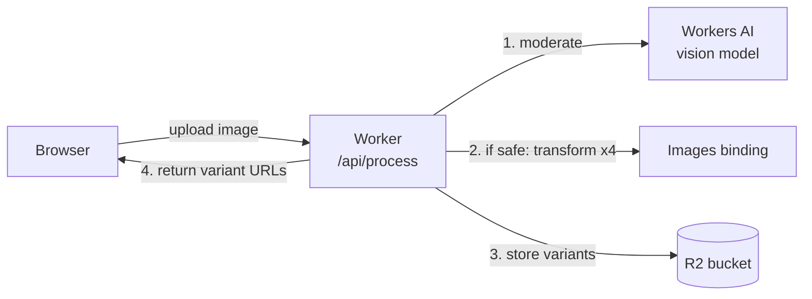
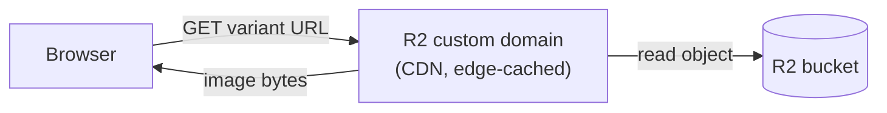

# Image Moderation → Transform → R2

A single Cloudflare Worker that:

1. **Ingests** an image via a drag & drop web UI.
2. **Moderates** it for NSFW / unsafe content using a **Workers AI** vision model.
3. **Generates 4 transformations** with the **Cloudflare Images** binding (only if safe).
4. **Uploads** each variant to **R2**.
5. **Serves** the variants from your **R2 custom domain**.

Everything runs at the edge inside one Worker — no origin server, no queues, no
external API calls. Compute (AI + image transforms) and storage (R2) are all
Cloudflare-native bindings.

## Architecture

### Flow 1 — Moderate & process (`POST /api/process`)



### Flow 2 — Serve variants (R2 custom domain)



The Worker is only in the **write** path (Flow 1). Finished images are served
**directly** by R2's custom domain (Flow 2), so delivery doesn't hit the Worker.

### Request lifecycle

```
Browser (public/index.html)
   │  ① POST /api/process  (multipart "image")
   ▼
Worker (src/index.ts)  ── handleProcess()
   │
   │  validate: is image? ≤ 20 MB?
   │
   ├─ ② moderateImage()
   │     env.AI.run(LLaVA, { image, prompt })
   │     parse "RATING: SAFE|UNSAFE"
   │     └─ UNSAFE / UNKNOWN ─────────────► 422, nothing stored (fail closed)
   │
   ├─ ③ transformAndStore()   (only when SAFE)
   │     for each of 4 specs, in parallel:
   │        env.IMAGES.input(stream).transform(...).output({format})
   │        env.BUCKET.put(`<uuid>/<variant>.<ext>`, bytes)
   │
   └─ ④ 200 JSON { safe, id, moderation, variants:[{ url }] }
            │
            ▼
Browser renders variant grid, loading images from:
   ⑤ https://<R2 custom domain>/<uuid>/<variant>.<ext>
```

### Components

| Component | Where | Responsibility |
| --- | --- | --- |
| **UI** | `public/index.html` (served by the `ASSETS` binding) | Drag & drop, preview, POST to `/api/process`, render verdict + variant grid. Pure vanilla JS, no build step. |
| **Router / handler** | `src/index.ts` → `fetch()` | Routes `POST /api/process` to the pipeline; everything else falls through to static assets. |
| **Moderation** | `moderateImage()` → `env.AI` | Runs the LLaVA vision model with a strict safety prompt, parses the verdict, **fails closed**. |
| **Transform + store** | `transformAndStore()` → `env.IMAGES` + `env.BUCKET` | Generates 4 variants in parallel and writes them to R2 with immutable cache headers. |
| **Delivery** | R2 custom domain | Serves stored objects publicly by key; the Worker is not in the read path. |

### Why this shape

- **One Worker, five bindings** (`ASSETS`, `AI`, `IMAGES`, `BUCKET`, + vars) — the
  entire app is a single deploy unit with no servers to manage.
- **Write path vs. read path are separate.** Uploads/transforms flow *through*
  the Worker; finished images are served *directly* by R2's custom domain, so
  image delivery doesn't consume Worker invocations and is edge-cached.
- **Fail closed.** Only images explicitly rated `SAFE` are ever written to R2.
- **Keys encode provenance:** `<uuid>/<variant>.<ext>` groups all variants of one
  upload under a shared id.

### Bindings (`wrangler.jsonc`)

| Binding | Type | Used for |
| --- | --- | --- |
| `env.ASSETS` | Static Assets | Serving `public/index.html` |
| `env.AI` | Workers AI | NSFW / content moderation |
| `env.IMAGES` | Images | Generating the 4 transformations |
| `env.BUCKET` | R2 bucket | Storing transformed variants |
| `env.R2_PUBLIC_URL` | Var | Base URL of the R2 custom domain |
| `env.MODERATION_MODEL` | Var | Which Workers AI model to moderate with |

## The 4 transformations

| Variant       | Transform                                   | Output       |
| ------------- | ------------------------------------------- | ------------ |
| `thumbnail`   | 320×320, `fit: cover`                       | WebP q80     |
| `wide`        | width 1280, `fit: scale-down`               | WebP q82     |
| `placeholder` | width 64 + blur 40 (LQIP)                   | WebP q60     |
| `vintage`     | width 800, brightness/contrast/gamma tweak  | JPEG q85     |

Edit the `TRANSFORMS` array in `src/index.ts` to change these.

## Prerequisites

- Cloudflare account with **Workers AI**, **Images**, and **R2** enabled.
- `wrangler` (installed as a dev dependency here).

## Setup

```bash
npm install

# 1. Create the R2 bucket (name must match wrangler.jsonc → bucket_name)
npx wrangler r2 bucket create image-moderation-r2

# 2. Connect a custom domain to the bucket so variants are publicly served.
#    The domain must be a subdomain of a zone on your Cloudflare account,
#    and the command requires that zone's id.
npx wrangler r2 bucket domain add image-moderation-r2 \
  --domain cdn.example.com \
  --zone-id <ZONE_ID> \
  --force
```

Then set the public URL in `wrangler.jsonc`:

```jsonc
"vars": {
  "R2_PUBLIC_URL": "https://cdn.example.com",
  "MODERATION_MODEL": "@cf/llava-hf/llava-1.5-7b-hf"
}
```

> The bucket's custom domain serves objects by key. This app stores objects at
> `<uuid>/<variant>.<ext>`, so a variant resolves to
> `https://cdn.example.com/<uuid>/thumbnail.webp`.

## Develop

Workers AI and the Images binding require **remote** mode:

```bash
npm run dev   # wrangler dev --remote
```

Open the printed URL, drag an image onto the dropzone.

## Deploy

```bash
npm run deploy
```

### Live deployment

| | |
| --- | --- |
| Worker custom domain | `https://moderate.agreatorganization.com` |
| Worker (workers.dev) | `https://image-moderation-r2.demosandpocs.workers.dev` |
| R2 custom domain | `https://image-moderation-r2.agreatorganization.com` |
| Moderation model | `@cf/meta/llama-3.2-11b-vision-instruct` |

The Worker's custom domain is configured via the `routes` block in
`wrangler.jsonc` (`custom_domain: true`) and provisioned automatically on
`wrangler deploy`. `workers_dev: true` keeps the `*.workers.dev` URL active too.

## Moderation notes

- There is no dedicated single-purpose NSFW model in the Workers AI catalog, so
  this uses the **Llama 3.2 11B Vision Instruct** model
  (`@cf/meta/llama-3.2-11b-vision-instruct`) with a strict content-safety rubric.
  It is materially more reliable at flagging nudity / explicit content than the
  smaller LLaVA-1.5 model used initially.
- The prompt forces a first line of `VERDICT: SAFE` or `VERDICT: UNSAFE`, run at
  low `temperature` for determinism. Parsing reads that explicit verdict token.
- The classifier **fails closed**: only an explicit `VERDICT: SAFE` is allowed
  through. Ambiguous / unparseable responses (`UNKNOWN`) are treated as unsafe
  and nothing is stored.
- Swap `MODERATION_MODEL` for any other Workers AI vision model without code
  changes (the handler reads both `response` and `description` output fields).

## Endpoints

| Method | Path           | Description                                       |
| ------ | -------------- | ------------------------------------------------- |
| `GET`  | `/`            | Drag & drop UI (static asset).                    |
| `POST` | `/api/process` | Multipart `image` field → moderation + variants.  |

`/api/process` response (safe):

```json
{
  "safe": true,
  "id": "b6f1…",
  "moderation": { "safe": true, "rating": "SAFE", "reason": "…", "model": "…" },
  "variants": [
    { "name": "thumbnail", "key": "b6f1…/thumbnail.webp", "url": "https://cdn.example.com/b6f1…/thumbnail.webp", "contentType": "image/webp" }
  ]
}
```
